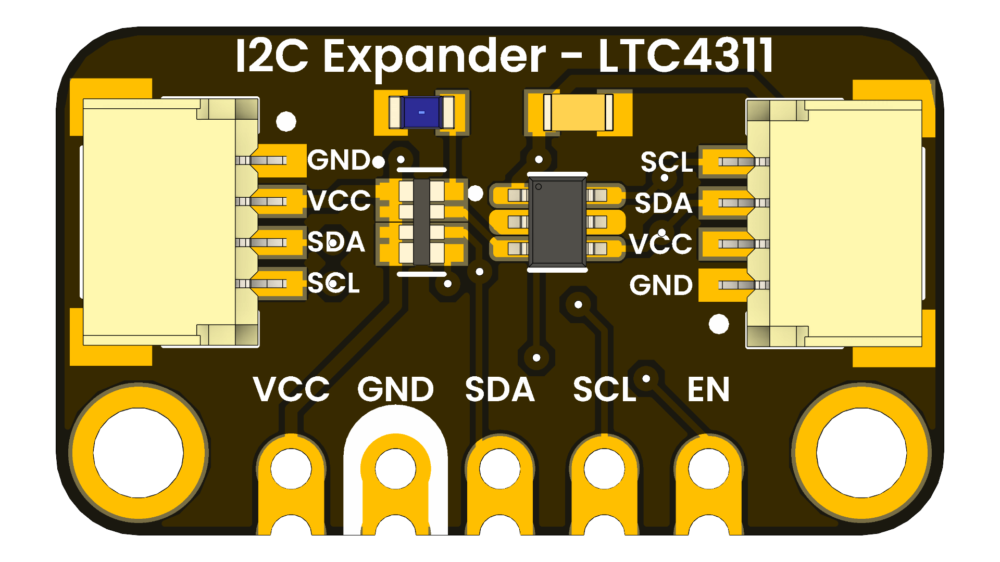

# DevLab: I2C LTC4311 Bus Extender Module

## Introduction
 

The I2C LTC4311 Bus Extender Module is designed to enhance the I2C communication range and reliability in your embedded systems. It utilizes the LTC4311 bus extender IC to boost I2C signals, allowing for longer cable lengths and improved noise immunity. This module is ideal for applications requiring robust I2C communication over extended distances.

  
  
  
  
   

  
  
<em>I2C Extender</em>

### Quick Setup

## Overview

| Feature                      | Description                        |
|------------------------------|------------------------------------|
| I2C Bus Extender             | Utilizes LTC4311 for signal boosting|
| Operating Voltage            | 3.3V to 5V                         |
| Communication Speed         | Up to 400 kHz                      |
| Connector Type               | Standard 4-pin I2C header          |
| Dimensions                   | 25mm x 20mm                        |
| Mounting                     | Through-hole or surface mount      |
| Compatibility                | Compatible with most microcontrollers and I2C devices |

## Applications
- Extending I2C communication range
- Improving signal integrity in noisy environments
- Industrial automation systems
- Sensor networks
- Home automation systems

## Resources
- [Product Wiki](#)
- [Datasheet](#)

## License

This product and its documentation are licensed under the MIT License.  
See [`LICENSE.md`](LICENSE.md) for details.

  Template by UNIT Electronics 

