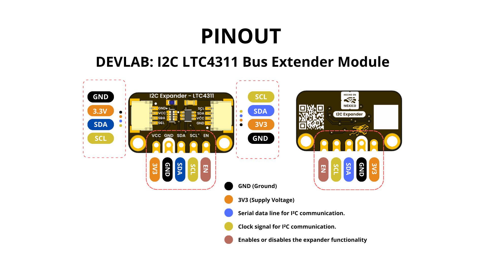
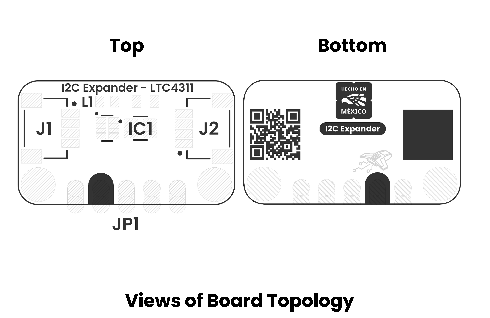

# Hardware

<a href="./unit_sch_v_1_0_0_ue0107_i2c_extender.pdf"> Schematic</a>

## Technical Specifications

### Electrical Characteristics

| **Parameter** |            **Description**            | **Min** | **Typ** | **Max** | **Unit** |
|:-------------:|:-------------------------------------:|:-------:|:-------:|:-------:|:--------:|
|      Vcc      | Input voltage to power on the module  |   1.6   |    -    |   5.5   |    V     |
|      Icc      |            Supply current             |    -    |   200   |   300   |    uA    |
|   Ibus(in)    |         Input Leakage Current         |    -    |    -    |   ±5    |    uA    |
|  Ienable(in)  |     Enable Input Leakage Current      |    -    |    -    |   ±10   |    uA    |
|     Iout      |            Output current             |    -    |    -    |   500   |    uA    |
|      Vth      | Bus Input Threshold Voltage VCC= 1.8V |  0.45   |  0.55   |  0.88   |    V     |
|               |               VCC= 2.5V               |  0.65   |  0.75   |  0.85   |    V     |
|               |           VCC= 2.7V to 5.5V           |  0.68   |  0.78   |  0.88   |    V     |
|    Vth_en     |       Enable threshold voltage        |   0.4   |    1    |   1.5   |    V     |
|     fmax      |    Bus Maximum Operating Frequency    |   400   |    -    |    -    |   kHz    |

## 🔌 Pinout

    <a href="#"> Pinout</a>
     
     
     

    

### Pin & Connector Layout

| Pin   | Voltage Level | Function                                                  |
|-------|---------------|-----------------------------------------------------------|
| VCC   | 3.3 V – 5.5 V | Provides power to the on-board regulator and sensor core. |
| GND   | 0 V           | Common reference for power and signals.                   |
| SDA   | 1.8 V to VCC  | Serial data line for I²C communications.                  |
| SCL   | 1.8 V to VCC  | Serial clock line for I²C communications.                 |

> **Note:** The module also includes a Qwiic/STEMMA QT connector carrying the same four signals (VCC, GND, SDA, SCL) for effortless daisy-chaining.

## 📃 Topology

<a href="./resources/unit_topology_v_1_0_0_ue0107_i2c_extender.png">  Topology</a>
 
 
 
| Ref. | Description                              |
|------|------------------------------------------|
| IC1  | LTC4311 I2C Extender                     |
| L1   | Power On LED                             | 
| JP1  | 2.54 mm Castellated Holes                |
| J1   | QWIIC Connector (JST 1 mm pitch) for I2C |
| J2   | QWIIC Connector (JST 1 mm pitch) for I2C |

## 📏 Dimensions

<a href="./resources/unit_dimension_v_1_0_0_ue0107_i2c_extender.png">  Dimensions</a>

# References

- <a href="https://www.analog.com/media/en/technical-documentation/data-sheets/4311fa.pdf">LTC4311 Datasheet </a>
